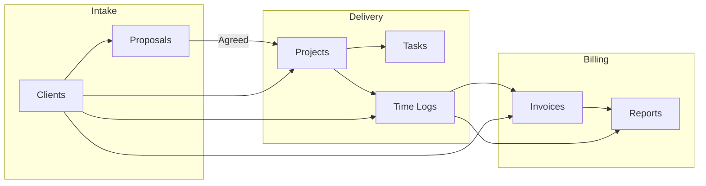
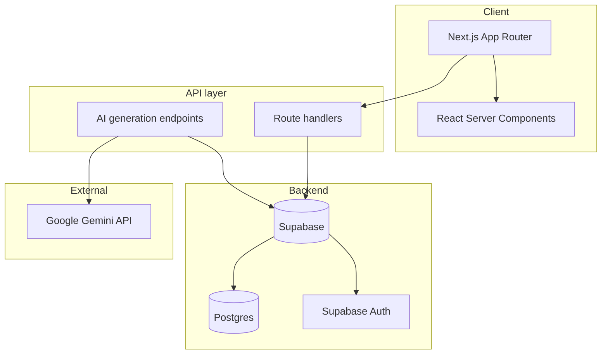

  

  
  
  
  
  

---

# DevBlueprint

### Enterprise-grade developer productivity and client management platform

**DevBlueprint** unifies project planning, time tracking, client relationships, and proposal-to-invoice workflows in a single, secure application. Built for freelancers, agencies, and engineering teams who need to move from idea to delivered work—and get paid—without switching tools.

---

## Table of contents

- [📋 Overview](#-overview)
- [✨ Features](#-features)
- [🏗️ Architecture](#️-architecture)
- [🛠️ Technology stack](#️-technology-stack)
- [📦 Data model](#-data-model)
- [🤖 AI capabilities](#-ai-capabilities)
- [🔒 Security & compliance](#-security--compliance)
- [🤝 Contributing](#-contributing)
- [📜 License](#-license)

---

## 📋 Overview

| | |
|:---|:---|
| **Purpose** | End-to-end workflow: **clients** → **proposals** → **projects** → **tasks** → **time** → **invoices** → **reports**. |
| **Audience** | Freelance developers, small dev shops, and teams that need a single source of truth for work and billing. |
| **Differentiator** | AI-assisted project blueprints and proposal content, Kanban task boards, shareable proposal links, and a modern, themeable UI. |

---

## ✨ Features

### 📊 Dashboard

| Capability | Description |
|------------|-------------|
| **At-a-glance metrics** | Active projects, active clients, hours logged this month, and unbilled amount in your preferred currency. |
| **Recent activity** | Recent projects and recent time logs for quick context. |
| **Upcoming work** | Upcoming tasks across projects so you can prioritize. |

---

### 🗂️ Projects

| Capability | Description |
|------------|-------------|
| **Project types** | Website, web application, mobile app, API, CLI, or other—with type-specific defaults. |
| **AI-generated blueprints** | Optional generation of core features, milestones, risk factors, technical requirements, feature dependencies, and integrations from a short brief (powered by Google Gemini). |
| **Kanban board** | Drag-and-drop task board with configurable columns (e.g. Backlog → Todo → In Progress → In Review → Done). |
| **Task metadata** | Priority (P1–P3), category (dev, design, content, SEO, DevOps, testing, other), and effort (low/medium/high). |
| **Project banner** | Optional banner image for visual identity. |
| **Client linkage** | Associate projects with clients for reporting and billing. |

---

### 👥 Clients

| Capability | Description |
|------------|-------------|
| **Contact & company** | Name, company, email, phone, website, address, and notes. |
| **Billing defaults** | Hourly rate and currency (e.g. GBP, USD) for time and invoices. |
| **Status** | Active, inactive, or archived. |
| **Avatar colour** | Optional colour for quick visual identification. |

---

### 📄 Proposals

| Capability | Description |
|------------|-------------|
| **Pre-project scope** | Title, description, type, tech stack, target audience, goals, and constraints. |
| **AI-generated content** | Optional generation of proposal narrative and structure (Gemini). |
| **Estimated price** | Optional AI or manual estimated price for the engagement. |
| **Slides / structure** | Support for slide-based or structured proposal content. |
| **Shareable links** | Public share via tokenised URL so clients can view without logging in. |
| **Conversion to project** | Turn an agreed proposal into a project with one action. |
| **Status** | Draft, sent, agreed, or declined. |

---

### ⏱️ Time logs

| Capability | Description |
|------------|-------------|
| **Client & project** | Log time against a client and optionally a project. |
| **Billable flag** | Mark entries as billable or non-billable. |
| **Rate override** | Optional hourly rate and currency per entry. |
| **Invoice linkage** | Attach time entries to an invoice for billing. |
| **Date** | Log against a specific date for accurate reporting. |

---

### 🧾 Invoices

| Capability | Description |
|------------|-------------|
| **Invoice number** | Unique invoice number per client/engagement. |
| **Totals** | Subtotal, tax rate, tax amount, and total in your chosen currency. |
| **Dates** | Issue date and due date. |
| **Status** | Draft, sent, paid, overdue, or cancelled. |
| **Time log attachment** | Pull in time log lines for amount calculation. |

---

### 📈 Reports

| Capability | Description |
|------------|-------------|
| **Reporting views** | Time and billing insights across clients and projects. |

---

### 🔐 Authentication & account

| Capability | Description |
|------------|-------------|
| **Email/password** | Sign up, login, forgot password, and reset password via Supabase Auth. |
| **Session handling** | Secure, HTTP-only cookie-based sessions with Supabase SSR. |
| **Account deletion** | Optional server-side account cleanup using the Supabase service role (when configured). |

---

### 🎨 User experience

| Capability | Description |
|------------|-------------|
| **Theme** | Light and dark mode with optional system preference detection. |
| **Command palette** | Global search and navigation (e.g. ⌘K). |
| **Responsive layout** | Sidebar navigation and layouts that adapt to screen size. |
| **Toasts** | Consistent notification feedback for actions (Sonner). |

---

## 🏗️ Architecture

High-level flow from client and proposal through to invoicing:

Application and data layer:

---

## 🛠️ Technology stack

| Layer | Technology | Notes |
|-------|------------|--------|
| **Framework** | Next.js 15 | App Router, server components, route handlers. |
| **UI** | React 19 | Latest React with compatible patterns. |
| **Language** | TypeScript 5.7 | Strict typing across app and lib. |
| **Styling** | Tailwind CSS 4 | Utility-first, design tokens, themeable. |
| **Backend** | Supabase | Postgres, Auth, Row Level Security, real-time optional. |
| **AI (optional)** | Google Gemini | Blueprint generation, task suggestions, proposal content. |
| **Drag and drop** | @hello-pangea/dnd | Accessible Kanban boards. |
| **Diagrams** | @xyflow/react | Flow/architecture diagrams. |
| **Icons** | Lucide React | Consistent icon set. |
| **Notifications** | Sonner | Toast notifications. |

---

## 📦 Data model

Core entities and relationships:

| Entity | Purpose |
|--------|---------|
| **clients** | Contact details, company, billing defaults (hourly rate, currency), status. |
| **projects** | Title, type, status, optional blueprint (JSON), optional client link, banner. |
| **tasks** | Kanban tasks per project: title, status, priority, category, effort, position. |
| **proposals** | Pre-project scope, optional generated content, estimated price, slides, share token, link to client and optional project. |
| **time_logs** | Hours, description, client/project, billable flag, rate, currency, optional invoice. |
| **invoices** | Invoice number, client, status, dates, subtotal, tax, total, currency. |

Row Level Security (RLS) is enabled on all tables so that users can only access their own rows. Schema is versioned via Supabase migrations in `supabase/migrations/`.

---

## 🤖 AI capabilities

When a **Gemini API key** is configured, DevBlueprint can:

| Feature | Input | Output |
|--------|--------|--------|
| **Project blueprint** | Title, description, type, tech stack, goals, constraints, target audience | Structured blueprint: core features (12+), milestones (4–8), risk factors (5–12), technical requirements (15–30), feature dependencies, integrations. |
| **Task list** | Same as above (or derived from blueprint) | Kanban-ready tasks (25–55) with status, priority, category, effort. |
| **Proposal content** | Proposal title, description, type, stack, goals, constraints | Narrative and structured proposal content. |
| **Proposal pricing** | Proposal context | Estimated price or price range. |

Without an API key, the app runs with AI features disabled or with rule-based fallbacks where implemented. No secrets are exposed to the client; generation runs server-side only.

---

## 🔒 Security & compliance

| Area | Approach |
|------|----------|
| **Authentication** | Supabase Auth (email/password). Passwords are not stored in application code. |
| **Authorization** | Postgres RLS so each user sees only their own clients, projects, tasks, proposals, time logs, and invoices. |
| **Secrets** | API keys and service role keys live in environment variables only; `.env` is gitignored. |
| **Server-side AI** | Gemini is called from route handlers; keys never sent to the browser. |
| **Session** | Supabase SSR client with secure, HTTP-only cookies. |

---

## 🤝 Contributing

1. **Fork** the repository.
2. **Create a branch** from `main` for your change.
3. **Implement** your change and run the project linter.
4. **Open a pull request** with a clear description and scope.

---

## 📜 License

This project is licensed under the MIT License. See the [LICENSE](LICENSE) file for details.

---

  DevBlueprint — plan, deliver, and get paid from one place.

